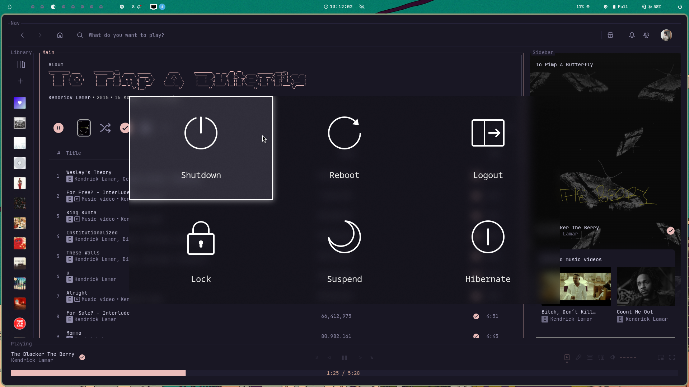
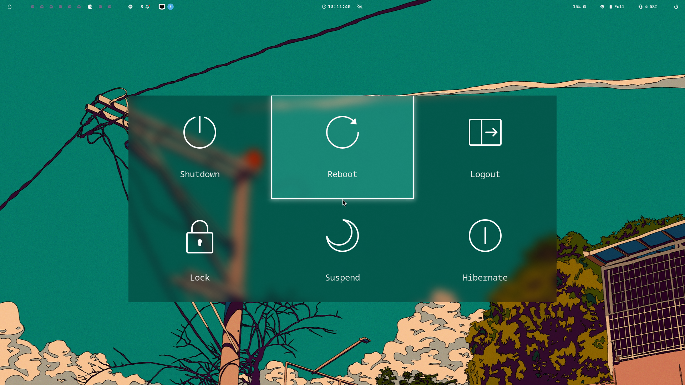

# python-hypr-power

## Overview
A power menu app written in Python, based on GTK 3, with options to shutdown, reboot, log out, suspend, hibernate, and lock.
It is designed specifically for use with the **Hyprland** compositor.

## Installation

### 1. Install system dependencies
Make sure you have **GTK 3** and **PyGObject** installed on your system.

- **Arch Linux**
  ```bash
  sudo pacman -S gtk3 python-gobject
- **Debian/Ubuntu**
  ```bash
  sudo apt install libgtk-3-dev python3-gi
### 2. Clone the repository
  ```bash
  git clone https://github.com/nevesrodrigo2/python-hypr-power.git
  cd python-hypr-power
  ```
### 3. Install Power Menu
  ```bash
  pipx ensurepath
  pipx install .
  ```
### Setting up


### Launcher script
The repository also includes a launcher script `python_hypr_power.sh`, so you can add it in your dot files to run whenever you want it (don't forget to make it executable).
#### Example:
```bash
chmod +x ~/.config/hypr/scripts/python_hypr_power.sh
```
## Blur
In order to get a blur effect in the menu, you need to include the following line, wherever you keep your window rules. 

`layerrule = blur, gtk-layer-shell`

This is very much recommended, since this configuration is essencial so your menu looks the exact same way as in the examples.

## Notes
- Font is currently being loaded from within the user's system. However, it's included in the repository as well. I decided going with Monospace instead of Inter. 

## Demo




